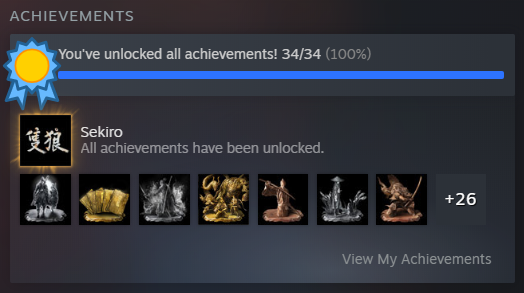

## About
Coming from a background of math and computer science, I develop algorithms and statistical methods for spatial data science. My work aims to better represent and mathematically model spatial problems and to chip away at our understanding of core geographical concepts, such as scale and process. Through algorithm design, I also seek to advance the principled use of (spatial) data science in social science. In my spare time, I love watching movies, playing video games, and biking. I'm currently a Ph.D student at Arizona State University in the Spatial Analysis Research Center (SPARC). 

## Research
Under development—more info about my work will go here eventually!

## Fun stuff
I was [featured during ASU Geo Week](https://www.instagram.com/p/CWdsyo5v3We/?utm_medium=copy_link)!

<!--I love From Software games and have gotten 100% game completion in Sekiro: Shadows Die Twice! .-->

## Publications
**T. D. Hoffman**, T. Oshan. (2021). "A Supervised Heuristic for a Balanced Approach to Regionalization." GIS Research UK Conference. [Link.](https://doi.org/10.5281/zenodo.4670015)

**T. Hoffman**\*, A. Swain\*, W. F. Fagan. (2021). "Trade-offs in sensory characteristics shape the evolution of perception." Frontiers in Ecology and Evolution, 9. [Link.](https://doi.org/10.3389/fevo.2021.698041)

A. Lawson, **T. Hoffman**, Y. Chung, K. Keegan, S. Day. (2021). "A density-based approach to feature detection in persistence diagrams for firn data." Foundations of Data Science. [Link.](http://dx.doi.org/10.3934/fods.2021012)

W. F. Fagan, **T. Hoffman**, D. Dahiya, E. Gurarie, R. S. Cantrell, C. Cosner. (2019). "Improved foraging by switching between diffusion and advection: benefits from movement that depends on spatial context." Theoretical Ecology, 13 (2), 127-136. [Link.](https://doi.org/10.1007/s12080-019-00434-w)
		
*\*equal contributions*
